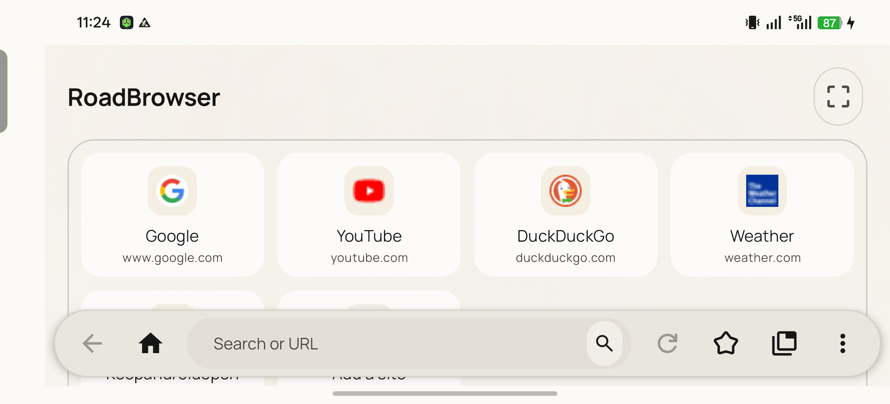

# RoadBrowser

**A WebView browser built for Android Auto head units: big touch targets, a car-first toolbar, and video that keeps playing when Maps takes over the screen.**

[](https://www.android.com/)
[](LICENSE)
[](https://github.com/Yash-v-maurya/RoadBrowser/releases/latest)

> [!WARNING]
> **Parked use only.** If you are driving, do not look at this app. RoadBrowser is for passengers, charging stops and parked time. You are responsible for how you use it.

---

## Download

- **GitHub Releases (recommended):** grab `RoadBrowser-<version>.apk` from the [latest release](https://github.com/Yash-v-maurya/RoadBrowser/releases/latest).
- **Obtainium (auto-updates):** install [Obtainium](https://github.com/ImranR98/Obtainium), then tap the button below to add RoadBrowser as a tracked app.

[](https://apps.obtainium.imranr.dev/redirect?r=obtainium://app/%7B%22id%22%3A%22com.yashmaurya.roadbrowser%22%2C%22url%22%3A%22https%3A%2F%2Fgithub.com%2FYash-v-maurya%2FRoadBrowser%22%2C%22author%22%3A%22Yash-v-maurya%22%2C%22name%22%3A%22RoadBrowser%22%2C%22preferredApkIndex%22%3A0%2C%22additionalSettings%22%3A%22%7B%5C%22includePrereleases%5C%22%3Afalse%2C%5C%22fallbackToOlderReleases%5C%22%3Atrue%2C%5C%22filterReleaseTitlesByRegEx%5C%22%3A%5C%22%5C%22%2C%5C%22filterReleaseNotesByRegEx%5C%22%3A%5C%22%5C%22%2C%5C%22verifyLatestTag%5C%22%3Afalse%2C%5C%22sortMethodChoice%5C%22%3A%5C%22date%5C%22%2C%5C%22useLatestAssetDateAsReleaseDate%5C%22%3Afalse%2C%5C%22releaseTitleAsVersion%5C%22%3Afalse%2C%5C%22trackOnly%5C%22%3Afalse%2C%5C%22versionExtractionRegEx%5C%22%3A%5C%22%5C%22%2C%5C%22matchGroupToUse%5C%22%3A%5C%22%5C%22%2C%5C%22versionDetection%5C%22%3Atrue%2C%5C%22releaseDateAsVersion%5C%22%3Afalse%2C%5C%22useVersionCodeAsOSVersion%5C%22%3Afalse%2C%5C%22apkFilterRegEx%5C%22%3A%5C%22%5C%22%2C%5C%22invertAPKFilter%5C%22%3Afalse%2C%5C%22autoApkFilterByArch%5C%22%3Atrue%2C%5C%22appName%5C%22%3A%5C%22%5C%22%2C%5C%22appAuthor%5C%22%3A%5C%22%5C%22%2C%5C%22shizukuPretendToBeGooglePlay%5C%22%3Afalse%2C%5C%22allowInsecure%5C%22%3Afalse%2C%5C%22exemptFromBackgroundUpdates%5C%22%3Afalse%2C%5C%22skipUpdateNotifications%5C%22%3Afalse%2C%5C%22about%5C%22%3A%5C%22%5C%22%2C%5C%22refreshBeforeDownload%5C%22%3Afalse%2C%5C%22includeZips%5C%22%3Afalse%2C%5C%22zippedApkFilterRegEx%5C%22%3A%5C%22%5C%22%7D%22%2C%22overrideSource%22%3Anull%7D)

Requires **Android 15 or later** on the phone. No special installer is needed; it is a normal APK.

---

## Features

- **Car-first bottom toolbar.** Back, Home, address pill, Reload, Bookmarks, Tabs (with count) and Menu are always within thumb reach along the bottom of the head-unit display.
- **Start page with quick links.** Up to six shortcut cards with cached site icons, a "resume last page" card and an optional custom background photo. Set a home page instead if you'd rather land on one site.
- **Real tabs.** Up to eight tabs, an in-app tab switcher, pop-ups open as new tabs, and optional session restore on launch.
- **Bookmarks.** Save the current page, manage bookmarks in-app, or share a link into RoadBrowser from any other app to bookmark it.
- **Brave Search + Shields.** Brave Search is the default engine (Google and DuckDuckGo are also available). Shields blocks known ad and tracker domains with a bundled blocklist and shows a live blocked count in Settings.
- **YouTube compatibility mode.** Forces the mobile YouTube interface and keeps playback-critical requests unblocked so videos load reliably.
- **Background audio playback.** Video and audio keep playing when the browser is not in the foreground, for example while Maps or the launcher is shown. A page shim keeps `document.hidden` reporting "visible" so sites like YouTube don't pause themselves.
- **MediaSession foreground service.** While something is playing, RoadBrowser holds a real media session. Steering-wheel next/previous/play/pause buttons and the phone's media notification control the page, and the OS won't freeze the browser once Maps has covered it for a while.
- **Desktop / mobile user agent.** Toggle desktop mode per session, and pick between an Android Chrome or Safari identity in Settings.
- **Voice input.** Web pages that use the Web Speech API get the phone's speech recognizer, with per-host microphone permission prompts.
- **SSL and cleartext handling.** Certificate problems show a clear warning with the reason and a "go back" default; plain-HTTP sites ask before loading.
- **Light, dark and auto themes.** Warm-white light theme by default, a charcoal dark theme, Manrope typography throughout, plus an optional beta setting that asks WebView to darken web pages algorithmically.
- **Global display scale** (40 to 200 percent) so the UI and page content fit your screen.
- **Fullscreen and DRM video.** Fullscreen playback survives brief focus loss, and Widevine L3 protected content works.
- **No analytics, no telemetry.** Nothing phones home; the only traffic is the pages you open and their icons.

---

## Install & show it in Android Auto

1. Download `RoadBrowser-<version>.apk` from the [latest release](https://github.com/Yash-v-maurya/RoadBrowser/releases/latest) and install it on your phone (allow installs from your browser or file manager if asked).
2. On the phone, open **Settings** and search for **Android Auto**.
3. Scroll to the bottom and tap **Version** ten times. Tap **OK** to enable developer mode.
4. Tap the **three-dot menu (⋮)** in the top-right corner, then **Developer settings**.
5. Turn on **Unknown sources**.
6. **Force-stop Android Auto** (App info > Force stop) or simply unplug and reconnect the phone.
7. RoadBrowser now appears in the car launcher alongside your other apps.

If it doesn't launch the first time, open a non-Google navigation app (for example Waze) on the head unit first, then open RoadBrowser.

A longer walkthrough, including the adb route and OnePlus/ColorOS battery settings, is in [docs/INSTALL.md](docs/INSTALL.md).

---

## Recommended settings for video while driving

Both of these are **on by default**; you only need to check them if you've changed something.

- **Settings > Media & playback > YouTube compatibility:** on. Mobile YouTube plays reliably on the head unit; the desktop site does not.
- **Settings > Media & playback > Keep audio playing in background:** on. This is what keeps a video going when you switch to Maps or the launcher, and what turns on the media session so the **steering-wheel next / previous / play / pause buttons** and the phone's media notification control playback.
- **OnePlus / ColorOS phones:** go to phone Settings > Apps > RoadBrowser > Battery and choose **Don't optimize** (or "Unrestricted"). Otherwise the OS may freeze the browser after a few minutes in the background and audio stops.

---

## Screenshots

<div align="center">
  
</div>

<div align="center">
  
</div>

---

## Build from source

Requirements: **JDK 21**, Android SDK with **platform 37** and a recent build-tools, and Git. The Gradle wrapper (Gradle 9.3, AGP 9.1) downloads everything else.

```powershell
git clone https://github.com/Yash-v-maurya/RoadBrowser.git
cd RoadBrowser
.\gradlew.bat assembleDebug      # debug build
.\gradlew.bat assembleRelease    # signed release build (needs a keystore, see below)
```

On macOS/Linux use `./gradlew` instead of `.\gradlew.bat`.

### Signing a release build

The release signing config in `app/build.gradle.kts` reads these four keys from Gradle properties, from `local.properties`, or from environment variables (in that order):

```properties
RELEASE_STORE_FILE=../release.keystore
RELEASE_STORE_PASSWORD=your-store-password
RELEASE_KEY_ALIAS=your-key-alias
RELEASE_KEY_PASSWORD=your-key-password
```

Put them in `local.properties` at the repo root (it is git-ignored). `RELEASE_STORE_FILE` is resolved relative to the `app/` module, so `../release.keystore` points at a keystore sitting next to `local.properties`.

The signed APK is written to:

```
app/build/renamedApks/release/RoadBrowser-<version>.apk
```

### Cutting a release

1. Bump `versionCode` and `versionName` in `app/build.gradle.kts`.
2. Update `CHANGELOG.md`.
3. Tag and push:

   ```bash
   git tag v2.2
   git push --tags
   ```

4. The `release.yml` workflow builds, signs and publishes a GitHub Release with the APK attached. It needs four repository secrets (Settings > Secrets and variables > Actions):

   | Secret | Value |
   | --- | --- |
   | `RELEASE_KEYSTORE_BASE64` | The keystore file, base64-encoded |
   | `RELEASE_STORE_PASSWORD` | Keystore password |
   | `RELEASE_KEY_ALIAS` | Key alias inside the keystore |
   | `RELEASE_KEY_PASSWORD` | Key password |

   To copy the base64 keystore to the clipboard on Windows:

   ```powershell
   [Convert]::ToBase64String([IO.File]::ReadAllBytes("release.keystore")) | Set-Clipboard
   ```

---

## Security

The only official source for RoadBrowser is **https://github.com/Yash-v-maurya/RoadBrowser**. Download APKs only from that repository's Releases page (or through Obtainium pointed at it). Any other site offering "RoadBrowser" is not affiliated with this project, and its APKs may be modified.

---

## License

RoadBrowser is free software under the **GNU General Public License v3.0**. See [LICENSE](LICENSE).

Made by Yash V Maurya
